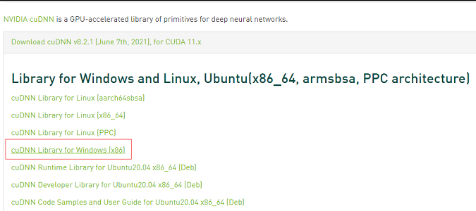
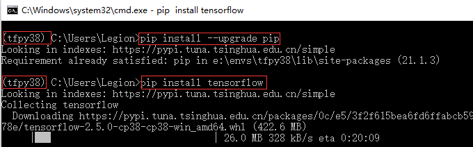

<!--
 * @Author: Ken Kaneki
 * @Date: 2021-07-20 18:56:15
 * @LastEditTime: 2021-07-21 13:32:53
 * @Description: README
-->
# 环境配置

## 版本说明

- Win10
- GPU: RTX 3070
- Anaconda3-2021.05+VS Code
- tensorflow2.5.0
- python3.8.10
- cuda11.2.133
- cuDNN8.2.1
- [tensorflow-gpu](https://blog.csdn.net/K1052176873/article/details/114526086)
- [requirements.txt](./requirements.txt)

```sh
pip install -r requirements.txt
```

------------------------------------------------

## [配置步骤](https://blog.csdn.net/qq_41662115/article/details/86420983)

### [安装cuda和cuDNN](https://zhuanlan.zhihu.com/p/94220564#)

#### 安装[cuda](https://developer.nvidia.com/cuda-11-3-1-download-archive?target_os=Windows&target_arch=x86_64&target_version=10&target_type=exe_local)


- 选择自定义安装，只勾选cuda选项


#### 安装[cuDNN](https://developer.nvidia.com/cudnn)



- 注册账户(满18周岁)并完成问卷调查即可下载对应版本的cuDNN
- 将文件复制到cuda中相对应的文件夹中
- 验证安装

```sh
C:\Users\Legion>nvcc -V
nvcc: NVIDIA (R) Cuda compiler driver
Copyright (c) 2005-2021 NVIDIA Corporation
Built on Mon_May__3_19:41:42_Pacific_Daylight_Time_2021
Cuda compilation tools, release 11.3, V11.3.109
Build cuda_11.3.r11.3/compiler.29920130_0
```

------------------------------------------------

### 安装[anaconda](https://www.anaconda.com/products/individual#Downloads)

- Anaconda3-2021.05(python3.8)


- 修改Anaconda默认虚拟环境路径

```cmd
conda config --add envs_dirs E:\envs
```

- 配置虚拟环境并进入




### 安装tensorflow(默认2.5.0)

```sh
pip install --upgrade pip
pip install tensorflow
```

- 验证版本

```sh
(tfpy38) C:\Users\Legion>python -V & pip -V
Python 3.8.10
pip 21.1.3 from E:\envs\tfpy38\lib\site-packages\pip (python 3.8)
(tfpy38) C:\Users\Legion>python
>>> import tensorflow as tf
>>> tf.__version__
'2.5.0'
```

- TensorFlow找不到cudart64_110.dll not found的解决方案
dlerror: cudart64_110.dll not found
[cudart64_110.dll](https://www.dll-files.com/cudart64_110.dll.html)
- 如缺少其他[dll](https://www.dll-files.com/c/)文件可自己下载
下载完之后，需要把改文件解压，然后将cudart64_110.dll放在文件夹下C:\Windows\System32
- 一般情况下，出现上述错误是因为没有安装cuda和cuDNN

------------------------------------------------

### VS Code配置Anaconda


- 配置完之后会提示安装pylint和autopep8,安装即可
- 左下角选择python解释器为虚拟环境解释器
- 可能会出现以下问题

```sh
CommandNotFoundError: Your shell has not been properly configured to use 'conda activate'.
```

- 解决方案

    管理员权限打开powershell

```sh
Set-ExecutionPolicy -Scope CurrentUser
ExecutionPolicy:remotesigned
```

- 后面每次打开vs code总会进入bash虚拟环境只需要在 VSCode 的settings.json中加入这一行配置即可：

```json
"python.terminal.activateEnvironment": false
```

- 直接设置Conda取消自动激活base(推荐)打开Powershell

```sh
conda config --set auto_activate_base false
```

#### 运行tf hello world例程验证环境配置成功

```py
import tensorflow as tf
if tf.test.gpu_device_name():
    print('Default GPU Device: {}'.format(tf.test.gpu_device_name()))
else:
    print("Please install GPU version of TF")

>>>Default GPU Device: /device:GPU:0
```

------------------------------------------------

<div STYLE="page-break-after: always;"></div>

# 程序执行

## 先进入tfpy38虚拟环境

## win10下运行linux命令

- 下载git
- 输入sh进入git环境

```sh
Legion@LAPTOP-G5IM3O9T MINGW64 /e/VSCode/Python/cloud_robotics/simulate_RL/FaceNet_four_action_simulator
$
```

## 工作地址声明

```sh
Legion@LAPTOP-G5IM3O9T MINGW64 /e/VSCode/Python/cloud_robotics/simulate_RL/FaceNet_four_action_simulator
$ export CLOUD_ROOT_DIR='E:\VSCode\Python\cloud_robotics'
```

- 每进一次git，就需要export

## 修改所有sh脚本文件

- 将python3改为python(win10由于只有一个python版本,因此里面没有python3命令)

------------------------------------------------

## 运行错误

```sh
AttributeError: module 'tensorflow' has no attribute 'XXX'
```

- 将所有涉及到py文件中的

```py
import tensorflow as tf
```

替换为

```sh
import tensorflow.compat.v1 as tf
tf.disable_eager_execution()  #关闭eager运算
tf.disable_v2_behavior()    #禁用TensorFlow 2.x行为
```

## 安装依赖库

### 安装matplotlib

- pip install matplotlib

### 安装pandas

- pip install pandas

### 导入其他文件夹里面的class

- sys.path.append('..')放在最前面

### 安装gym

- pip install gym

### 安装seaborn

- pip install seaborn

------------------------------------------------

## 运行代码

### 模型训练脚本(可以不执行)

```sh
sh
cd simulate_RL/FaceNet_four_action_simulator
sh train_RL.sh
```

- 结果存储文件夹：scratch_results

### 评估图生成脚本(必须执行)

- recreate_submission_plot_RL_agent_pretrained.sh

```txt
这个脚本是新的，存储路径在backup_key_results里面
```

```sh
sh recreate_submission_plot_RL_agent_pretrained.sh
```

- eval_pretrain_RL_FourAction_fnet.sh

```txt
这个脚本是旧的，存储路径在scratch_results里面，和模型训练程序的输出路径在同一个目录下
```

```sh
sh eval_pretrain_RL_FourAction_fnet.sh
```

- 结果存储文件夹：backup_key_results

## 运行内容


### EVALUATE A PRE-TRAINED RL AGENT on the new test traces and log the results

```sh
python evaluate_RL_offload_utils.py
```

### run the baselines

```sh
python FourAction_policy_rollouts.py
```

### plot a boxplot of all different controllers

```sh
python pubQuality_boxplot_FourAction_env.py
```

### plot a pareto optimal covariance plot shown in paper

```sh
python loss_cost_pareto_plot_ellipsoid.py
```

------------------------------------------------

## 运行参数

- 这个程序一共五个控制器，每个控制器有7个测试值，每个控制器要训练20次，每次五个控制器轮回测试，每个控制器每个数值每测试一次平均5s，一共5×7×20×5=3500s，大约跑一次程序要耗费一小时
TRAIN_QUERY_LIST="0.10,0.20,0.50,0.70,1.0"

- this is for the test traces

```sh
QUERY_LIST="0.05,0.15,0.30,0.45,0.80,0.9,0.95"
#QUERY_LIST="0.10"
```

- seeds for the stochastic traces to test on

```sh
TEST_SEEDS="10,20,30,40,50,60,70,80,90,100,110,120,130,140,150,160,170,180,190,200"
# uncomment for smaller tests
#TEST_SEEDS="10,20,30,40,50"
#TEST_SEEDS="10"
```

## 文件夹地址格式错误

- 删除 recreate_submission_plot_RL_agent_pretrained.sh中多余的'/'
- 将py文件中'/'换为'\\'

## 坐标修改(Heuristic Oracle)

- loss_cost_pareto_plot_ellipsoid.py

```py
 # ['Unnamed: 0', 'accuracy_cost_mean', 'accuracy_cost_sum', 'controller_name', 'episode', 'query_cost_mean', 'query_cost_sum', 'reward_mean', 'reward_sum']
    reward_mean_latex = r'Episode Reward'
    query_cost_mean_latex = r'Offloading Cost'
    accuracy_cost_mean_latex = r'Classification Loss'
```

```py
 # map the simple names in the dataframe to LaTex display names for the policy plots
    remap_name_dict = {}
    remap_name_dict['random'] = r'$\pi_{\mathtt{random}}^{\mathtt{}}$'
    remap_name_dict['past_edge'] = r'$\pi_{\mathtt{offload}}^{\mathtt{past-robot}}$'
    remap_name_dict['curr_edge'] = r'$\pi_{\mathtt{vehicle}}^{\mathtt{}}$'
    remap_name_dict['past_cloud'] = r'$\pi_{\mathtt{offload}}^{\mathtt{past-cloud}}$'
    remap_name_dict['curr_cloud'] = r'$\pi_{\mathtt{edge}}^{\mathtt{}}$'
    remap_name_dict['RL'] = r'$\pi_{\mathtt{RL}}^{\mathtt{}}$'
    remap_name_dict['oracle'] = r'$\pi_{\mathtt{offload}}^{\mathtt{semiOracle1}}$'
    remap_name_dict['pure_oracle'] = r'$\pi_{\mathtt{Oracle}}^{\mathtt{}}$'

    # get the policy name for the threshold heuristic controllers by extracting their threshold
    threshold_val_list = []
    for ctrller in controller_names_list:
        if ctrller.startswith('threshold'):
            threshold_val = ctrller.split('-')[1]
            #remap_name_dict[ctrller] = r'$\pi_{\mathtt{offload}}^{\mathtt{thresh-' + str(threshold_val) + '}}$'
            remap_name_dict[ctrller] = r'$\pi_{\mathtt{heuristic}}^{\mathtt{}}$'
            threshold_val_list.append(threshold_val)
```

```py
    '''
    ax.text(0.5, 0.25, 'All-Robot', fontsize=15)
    ax.text(1.6, 0.3, 'Random', fontsize=15)
    ax.text(1.6, 0.15, 'Heuristic', fontsize=15)
    ax.text(2.5, 0.05, 'All-Cloud', fontsize=15)
    ax.text(0.6, 0.05, 'RL', fontsize=15)

    #ax.text(0.75, 0.1, 'Oracle', fontsize=15)
    '''
```

- pubQuality_boxplot_FourAction_env.py

```py
# ['Unnamed: 0', 'accuracy_cost_mean', 'accuracy_cost_sum', 'controller_name', 'episode', 'query_cost_mean', 'query_cost_sum', 'reward_mean', 'reward_sum']

    reward_mean_latex = r'Episode Reward'
    query_cost_mean_latex = r'Model Query Cost'
    accuracy_cost_mean_latex = r'Classification Loss'
```

```py
# map the simple names in the dataframe to LaTex display names for the policy plots
    remap_name_dict = {}
    remap_name_dict['random'] = r'$\pi_{\mathtt{random}}^{\mathtt{}}$'
    remap_name_dict['past_edge'] = r'$\pi_{\mathtt{offload}}^{\mathtt{past-robot}}$'
    remap_name_dict['curr_edge'] = r'$\pi_{\mathtt{vehicle}}^{\mathtt{}}$'
    remap_name_dict['past_cloud'] = r'$\pi_{\mathtt{offload}}^{\mathtt{past-cloud}}$'
    remap_name_dict['curr_cloud'] = r'$\pi_{\mathtt{edge}}^{\mathtt{}}$'
    remap_name_dict['RL'] = r'$\pi_{\mathtt{RL}}^{\mathtt{}}$'
    remap_name_dict['oracle'] = r'$\pi_{\mathtt{offload}}^{\mathtt{semiOracle1}}$'
    remap_name_dict['pure_oracle'] = r'$\pi_{\mathtt{Oracle}}^{\mathtt{}}$'

    # get the policy name for the threshold heuristic controllers by extracting their threshold
    threshold_val_list = []
    for ctrller in controller_names_list:
        if ctrller.startswith('threshold'):
            threshold_val = ctrller.split('-')[1]
            #remap_name_dict[ctrller] = r'$\pi_{\mathtt{offload}}^{\mathtt{thresh-' + str(threshold_val) + '}}$'
            remap_name_dict[ctrller] = r'$\pi_{\mathtt{heuristic}}^{\mathtt{}}$'
            threshold_val_list.append(threshold_val)
```

------------------------------------------------

<div STYLE="page-break-after: always;"></div>

# 运行结果

- <font color=#FF000 >**begin**</font>

```sh
$ sh recreate_submission_plot_RL_agent_pretrained.sh
E:\VSCode\Python\cloud_robotics\DNN_models\RL_checkpoints\facenet_4action\model\
2021-07-21 12:50:53.777001: I tensorflow/stream_executor/platform/default/dso_loader.cc:53] Successfully opened dynamic library cudart64_110.dll
WARNING:tensorflow:From E:\envs\tfpy38\lib\site-packages\tensorflow\python\compat\v2_compat.py:96: disable_resource_variables (from tensorflow.python.ops.variable_scope) is deprecated and
will be removed in a future version.
Instructions for updating:
non-resource variables are not supported in the long term
EVALUATING A TRAINED RL AGENT
ENV NAME:  FourAction
test_seeds:  [10, 20, 30, 40, 50, 60, 70, 80, 90, 100, 110, 120, 130, 140, 150, 160, 170, 180, 190, 200]
query_budget_fraction_list:  [0.05, 0.15, 0.3, 0.45, 0.8, 0.9, 0.95]
loading model from:  E:\VSCode\Python\cloud_robotics\DNN_models\RL_checkpoints\facenet_4action\model\  logging:  E:\VSCode\Python\cloud_robotics\backup_key_results
num_actions:  4
2021-07-21 12:50:56.164091: I tensorflow/stream_executor/platform/default/dso_loader.cc:53] Successfully opened dynamic library nvcuda.dll
2021-07-21 12:50:56.189240: I tensorflow/core/common_runtime/gpu/gpu_device.cc:1733] Found device 0 with properties:
pciBusID: 0000:01:00.0 name: NVIDIA GeForce RTX 3070 Laptop GPU computeCapability: 8.6
coreClock: 1.56GHz coreCount: 40 deviceMemorySize: 8.00GiB deviceMemoryBandwidth: 417.29GiB/s
2021-07-21 12:50:56.189574: I tensorflow/stream_executor/platform/default/dso_loader.cc:53] Successfully opened dynamic library cudart64_110.dll
2021-07-21 12:50:56.204681: I tensorflow/stream_executor/platform/default/dso_loader.cc:53] Successfully opened dynamic library cublas64_11.dll
2021-07-21 12:50:56.204857: I tensorflow/stream_executor/platform/default/dso_loader.cc:53] Successfully opened dynamic library cublasLt64_11.dll
2021-07-21 12:50:56.208312: I tensorflow/stream_executor/platform/default/dso_loader.cc:53] Successfully opened dynamic library cufft64_10.dll
2021-07-21 12:50:56.209741: I tensorflow/stream_executor/platform/default/dso_loader.cc:53] Successfully opened dynamic library curand64_10.dll
2021-07-21 12:50:56.212657: I tensorflow/stream_executor/platform/default/dso_loader.cc:53] Successfully opened dynamic library cusolver64_11.dll
2021-07-21 12:50:56.215902: I tensorflow/stream_executor/platform/default/dso_loader.cc:53] Successfully opened dynamic library cusparse64_11.dll
2021-07-21 12:50:56.216784: I tensorflow/stream_executor/platform/default/dso_loader.cc:53] Successfully opened dynamic library cudnn64_8.dll
2021-07-21 12:50:56.216989: I tensorflow/core/common_runtime/gpu/gpu_device.cc:1871] Adding visible gpu devices: 0
2021-07-21 12:50:56.217453: I tensorflow/core/platform/cpu_feature_guard.cc:142] This TensorFlow binary is optimized with oneAPI Deep Neural Network Library (oneDNN) to use the following CPU instructions in performance-critical operations:  AVX AVX2
To enable them in other operations, rebuild TensorFlow with the appropriate compiler flags.
2021-07-21 12:50:56.218258: I tensorflow/core/common_runtime/gpu/gpu_device.cc:1733] Found device 0 with properties:
pciBusID: 0000:01:00.0 name: NVIDIA GeForce RTX 3070 Laptop GPU computeCapability: 8.6
coreClock: 1.56GHz coreCount: 40 deviceMemorySize: 8.00GiB deviceMemoryBandwidth: 417.29GiB/s
2021-07-21 12:50:56.218562: I tensorflow/core/common_runtime/gpu/gpu_device.cc:1871] Adding visible gpu devices: 0
2021-07-21 12:50:56.607564: I tensorflow/core/common_runtime/gpu/gpu_device.cc:1258] Device interconnect StreamExecutor with strength 1 edge matrix:
2021-07-21 12:50:56.607884: I tensorflow/core/common_runtime/gpu/gpu_device.cc:1264]      0
2021-07-21 12:50:56.608029: I tensorflow/core/common_runtime/gpu/gpu_device.cc:1277] 0:   N
2021-07-21 12:50:56.608300: I tensorflow/core/common_runtime/gpu/gpu_device.cc:1418] Created TensorFlow device (/job:localhost/replica:0/task:0/device:GPU:0 with 5484 MB memory) -> physical GPU (device: 0, name: NVIDIA GeForce RTX 3070 Laptop GPU, pci bus id: 0000:01:00.0, compute
capability: 8.6)
A2C, self.n_a:  4
A2C, self.n_s:  13
WARNING:tensorflow:From E:\envs\tfpy38\lib\site-packages\tensorflow\python\util\dispatch.py:206: multinomial (from tensorflow.python.ops.random_ops) is deprecated and will be removed in a
future version.
Instructions for updating:
Use `tf.random.categorical` instead.
checkpoint loaded:  checkpoint-380520
#####################
start RL: seed 10 , budget:  0.05
FACENET 4 action reset seed:  10
fixed query budget: 0.05
2021-07-21 12:50:57.043027: I tensorflow/stream_executor/platform/default/dso_loader.cc:53] Successfully opened dynamic library cublas64_11.dll
2021-07-21 12:50:57.657992: I tensorflow/stream_executor/platform/default/dso_loader.cc:53] Successfully opened dynamic library cublasLt64_11.dll
2021-07-21 12:50:57.658270: I tensorflow/stream_executor/cuda/cuda_blas.cc:1838] TensorFloat-32 will be used for the matrix multiplication. This will only be logged once.
FourActionSimulator-FACENET seed 10 Controller:  RL
```

- <font color=#FF000 >**mid**</font>(仅展示0.95+200组合的输出信息)

```sh
FACENET 4 action reset seed:  200
fixed query budget: 0.95
FourActionSimulator-FACENET seed 200 Controller:  curr_edge
episode mean/median reward:  -2.132 -1.0
action_diversity:  [80.0, 0.0, 79.0, 0.0]
num queries remain:  76
random query budget frac:  0.95

#######################
END EPISODE FourActionV1 all-edge:
done action:  0 2  , flag :  True
time:  80
mean reward:  -2.132
#######################

FACENET 4 action reset seed:  200
fixed query budget: 0.95
FourActionSimulator-FACENET seed 200 Controller:  curr_cloud
episode mean/median reward:  -2.525 -1.0
action_diversity:  [4.0, 76.0, 4.0, 76.0]
num queries remain:  0
random query budget frac:  0.95

#######################
END EPISODE FourActionV1 all-cloud
done action:  1 3  , flag :  True
time:  80
mean reward:  -2.525
#######################

FACENET 4 action reset seed:  200
fixed query budget: 0.95
FourActionSimulator-FACENET seed 200 Controller:  random
episode mean/median reward:  -3.163 -1.0
action_diversity:  [42.0, 38.0, 27.0, 28.0]
num queries remain:  48
random query budget frac:  0.95

#######################
END EPISODE FourActionV1 random
time:  80
mean reward:  -3.163
```


- <font color=#FF000 >**end**</font>

```sh
SUMMARY REWARDS STATS
controller_name
curr_cloud      -368.0
curr_edge       -349.0
pure_oracle      -62.0
random          -454.5
threshold-0.5   -379.0
Name: reward_sum, dtype: float64
attempting to delete  E:\VSCode\Python\cloud_robotics\backup_key_results\boxplot_facenet_4action  path  E:\VSCode\Python\cloud_robotics\backup_key_results\boxplot_facenet_4action\
子目录或文件 -p 已经存在。
处理: -p 时出错。
SUMMARY REWARDS STATS
controller_name
RL              -105.0
curr_cloud      -368.0
curr_edge       -349.0
pure_oracle      -62.0
random          -454.5
threshold-0.5   -379.0
Name: reward_sum, dtype: float64
E:\VSCode\Python\cloud_robotics\simulate_RL\FaceNet_four_action_simulator\pubQuality_boxplot_FourAction_env.py:87: RuntimeWarning: divide by zero encountered in double_scalars
  fold = RL_value/value
best_threshold_controller threshold-0.5
best_threshold_reward -379.0
{'random': '$\\pi_{\\mathtt{random}}^{\\mathtt{}}$', 'past_edge': '$\\pi_{\\mathtt{offload}}^{\\mathtt{past-robot}}$', 'curr_edge': '$\\pi_{\\mathtt{vehicle}}^{\\mathtt{}}$', 'past_cloud': '$\\pi_{\\mathtt{offload}}^{\\mathtt{past-cloud}}$', 'curr_cloud': '$\\pi_{\\mathtt{edge}}^{\\mathtt{}}$', 'RL': '$\\pi_{\\mathtt{RL}}^{\\mathtt{}}$', 'oracle': '$\\pi_{\\mathtt{offload}}^{\\mathtt{semiOracle1}}$', 'pure_oracle': '$\\pi_{\\mathtt{Oracle}}^{\\mathtt{}}$', 'threshold-0.5': '$\\pi_{\\mathtt{heuristic}}^{\\mathtt{}}$'}
findfont: Font family ['normal'] not found. Falling back to DejaVu Sans.
findfont: Font family ['normal'] not found. Falling back to DejaVu Sans.
attempting to delete  E:\VSCode\Python\cloud_robotics\backup_key_results\ELLIPSE_facenet_4action  path  E:\VSCode\Python\cloud_robotics\backup_key_results\ELLIPSE_facenet_4action\
子目录或文件 -p 已经存在。
处理: -p 时出错。
SUMMARY REWARDS STATS
controller_name
RL              -105.0
curr_cloud      -368.0
curr_edge       -349.0
pure_oracle      -62.0
random          -454.5
threshold-0.5   -379.0
Name: reward_sum, dtype: float64
best_threshold_controller threshold-0.5
best_threshold_reward -379.0
{'random': '$\\pi_{\\mathtt{random}}^{\\mathtt{}}$', 'past_edge': '$\\pi_{\\mathtt{offload}}^{\\mathtt{past-robot}}$', 'curr_edge': '$\\pi_{\\mathtt{vehicle}}^{\\mathtt{}}$', 'past_cloud': '$\\pi_{\\mathtt{offload}}^{\\mathtt{past-cloud}}$', 'curr_cloud': '$\\pi_{\\mathtt{edge}}^{\\mathtt{}}$', 'RL': '$\\pi_{\\mathtt{RL}}^{\\mathtt{}}$', 'oracle': '$\\pi_{\\mathtt{offload}}^{\\mathtt{semiOracle1}}$', 'pure_oracle': '$\\pi_{\\mathtt{Oracle}}^{\\mathtt{}}$', 'threshold-0.5': '$\\pi_{\\mathtt{heuristic}}^{\\mathtt{}}$'}

controller_name:  $\pi_{\mathtt{random}}^{\mathtt{}}$
0.9913336378440708 0.2593531372059625

0.2672069924781818

controller_name:  $\pi_{\mathtt{vehicle}}^{\mathtt{}}$
0.5 0.1889240506329114

0.0

controller_name:  $\pi_{\mathtt{edge}}^{\mathtt{}}$
1.4855652339168526 0.12842159428086955

0.7947975824843596

controller_name:  $\pi_{\mathtt{heuristic}}^{\mathtt{}}$
1.0234322777255604 0.11723243719609755

0.25472645568840746

controller_name:  $\pi_{\mathtt{RL}}^{\mathtt{}}$
0.6726049838593614 0.03980394274467847

0.08645277764224792

controller_name:  $\pi_{\mathtt{Oracle}}^{\mathtt{}}$
0.5753549141837466 0.009415343060301043

0.12689548737544387
No handles with labels found to put in legend.
findfont: Font family ['normal'] not found. Falling back to DejaVu Sans.
findfont: Font family ['normal'] not found. Falling back to DejaVu Sans.
```

## <font color=#FF000 >**存在问题**</font>

### 处理-p文件错误

```sh
attempting to delete  E:\VSCode\Python\cloud_robotics\backup_key_results\boxplot_facenet_4action  path  E:\VSCode\Python\cloud_robotics\backup_key_results\boxplot_facenet_4action\
子目录或文件 -p 已经存在。
处理: -p 时出错。

attempting to delete  E:\VSCode\Python\cloud_robotics\backup_key_results\ELLIPSE_facenet_4action  path  E:\VSCode\Python\cloud_robotics\backup_key_results\ELLIPSE_facenet_4action\
子目录或文件 -p 已经存在。
处理: -p 时出错。

```

- 解决方法，修改[textfile_utils.py](..\utils\textfile_utils.py)

```py
def remove_and_create_dir(path):
    """ System call to rm -rf and then re-create a dir """

    dir = os.path.dirname(path)
    print('attempting to delete ', dir, ' path ', path)
    if os.path.exists(path):
        os.system("rm -rf " + path)
    os.system("mkdir -p " + path)
```

修改为

```py
def remove_and_create_dir(path):
    """ System call to rm -rf and then re-create a dir """

    dir = os.path.dirname(path)
    print('attempting to delete ', dir, ' path ', path)
    if os.path.exists(path):
        print('dir or file had exit,remove and recreate')
        os.system("rd/s/q " + path)#强制删除含有子目录、文件的目录
        #os.system("rm -rf" + path)
    #os.system("mkdir -p "+ path)
    os.system("mkdir " + path)
```

- <font color=#0FF00 >**该问题已成功解决**</font>

### <font color=#FFF00 >Warnning</font>

- 版本较低所产生的警告信息，即第三方库版本高于代码版本，**对结果没有影响**

```sh
WARNING:tensorflow:From E:\envs\tfpy38\lib\site-packages\tensorflow\python\compat\v2_compat.py:96: disable_resource_variables (from tensorflow.python.ops.variable_scope) is deprecated and will be removed in a future version.
non-resource variables are not supported in the long term

WARNING:tensorflow:From E:\envs\tfpy38\lib\site-packages\tensorflow\python\util\dispatch.py:206: multinomial
(from tensorflow.python.ops.random_ops) is deprecated and will be removed in a future version.

MatplotlibDeprecationWarning: Support for setting the 'text.latex.preamble' or 'pgf.preamble' rcParam to a list of strings is deprecated since 3.3 and will be removed two minor releases later; set it to a single string instead.
  plt.rcParams['text.latex.preamble'] = [r'\boldmath']
MatplotlibDeprecationWarning: Support for setting the 'text.latex.preamble' or 'pgf.preamble' rcParam to a list of strings is deprecated since 3.3 and will be removed two minor releases later; set it to a single string instead.
  plt.rcParams['text.latex.preamble'] = [r'\boldmath']
MatplotlibDeprecationWarning: Support for setting the 'text.latex.preamble' or 'pgf.preamble' rcParam to a list of strings is deprecated since 3.3 and will be removed two minor releases later; set it to a single string instead.
  plt.rcParams['text.latex.preamble'] = [r'\boldmath']

```

- <font color=#90900 >除数为0->[pubQuality_boxplot_FourAction_env.py第87行](..\simulate_RL\FaceNet_four_action_simulator\pubQuality_boxplot_FourAction_env.py)(**未解决**)</FONT>

```sh
RuntimeWarning: divide by zero encountered in double_scalars
```

- <font color=#90900 >找不到标签->[plotting_utils.py](..\utils\plotting_utils.py)(**未解决**)</FONT>

```sh
No handles with labels found to put in legend
```

```txt
第一种：plt.scatter()没写label项
plt.legend()就是为了展示标签，前面函数中没有定义，自然无法显示

解决方法：plt.scatter() 中加入 label = “XX”

第二种：plt.plot(),plt.figure()顺序错误
解决方案：我们将plt.figure()放到plt.plot()后面，也就是先加入label，然后再使用显示，这样就可以得到我们想输出的标签
```

- <font color=#3F800 >matlab库字体缺失(**未解决**)</font>

```sh
findfont: Font family ['normal'] not found. Falling back to DejaVu Sans
```

## 效果评估图


- [箱线图](../backup_key_results/boxplot_facenet_4action)

- [帕雷托图](../backup_key_results/ELLIPSE_facenet_4action)
